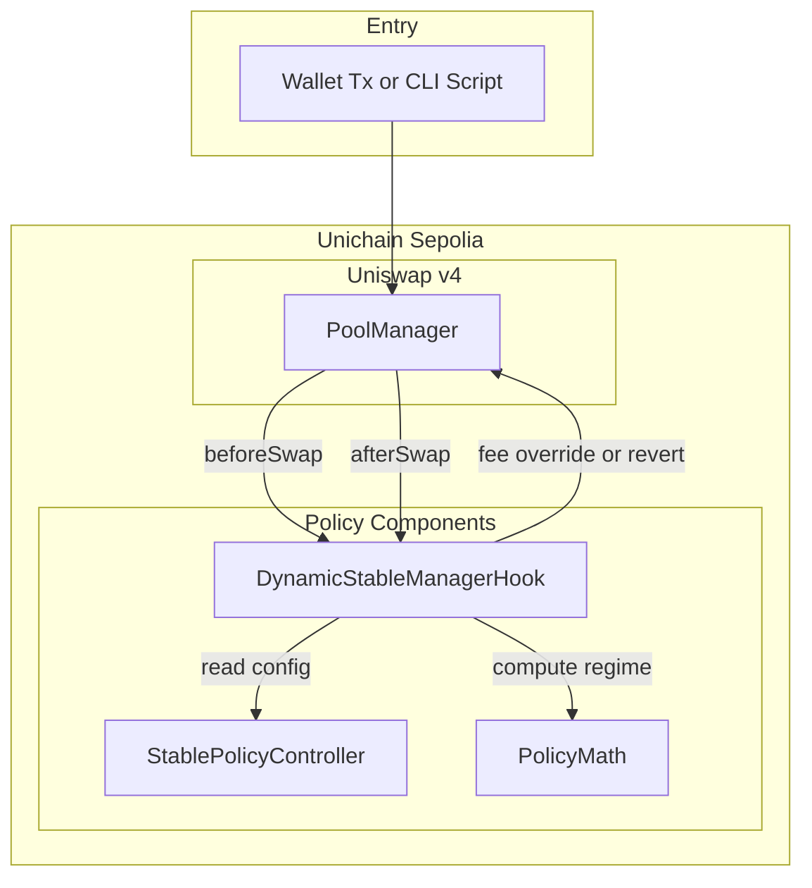
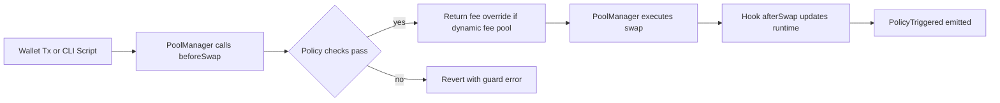
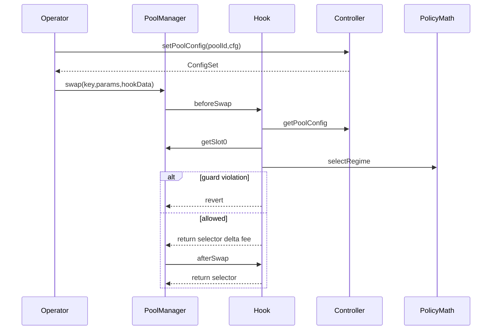
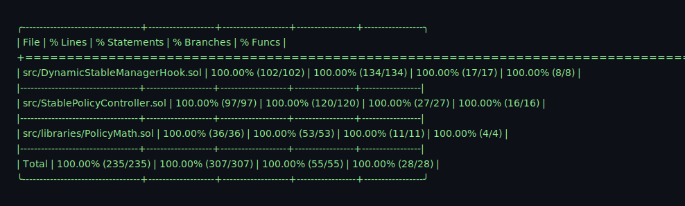

# Dynamic Stablecoin Manager Hook
**Built on Uniswap v4 · Deployed on Unichain Sepolia**
_Targeting: Uniswap Foundation Prize · Unichain Prize_

> Adaptive-fee, deterministic peg-defense management for Uniswap v4 stable pools.


## The Problem

Stablecoin pools are exposed to regime shifts where static execution rules become unsafe. During depegs, fixed fee tiers and no deterministic guardrails let toxic flow route quickly against LP inventory.

| Layer | Failure Mode |
|---|---|
| Pricing | Static fee tier cannot adapt to depeg stress. |
| Execution | No deterministic per-swap max size and impact guardrails. |
| Governance | Manual parameter changes lag market state during stress windows. |
| Risk Control | No built-in hysteresis or cooldown to reduce policy flapping. |

The result is predictable LP adverse selection exactly when stablecoin markets are most unstable.

## The Solution

The system enforces deterministic policy at swap time, inside a Uniswap v4 hook.

1. `StablePolicyController` stores per-pool peg bands, fee schedule, and guardrails.
2. `DynamicStableManagerHook.beforeSwap` reads pool config and current `slot0` state.
3. `PolicyMath.selectRegime` computes `NORMAL`, `SOFT_DEPEG`, or `HARD_DEPEG`.
4. Hook enforces cooldown, `maxSwap`, and `maxImpact` based on selected regime.
5. For dynamic-fee pools, hook returns per-swap LP fee override; otherwise guardrails still apply.
6. `afterSwap` updates runtime observations (`lastTick`, timestamps) for next decision.

Core insight: the pool policy itself can be deterministic on-chain state, not an off-chain reaction loop.

## Architecture

### Component Overview

```text
src/
  StablePolicyController.sol           # Per-pool policy storage, admin controls, nonce/timelock validation
  DynamicStableManagerHook.sol         # Uniswap v4 swap hook; regime select + guard enforcement
  libraries/
    PolicyMath.sol                     # Pure regime math, hysteresis, impact estimation
scripts/
  deploy-unichain.sh                   # Deploy + persist addresses to .env
  demo-testnet.sh                      # On-chain policy demo + tx URL proof
  demo-workflow.sh                     # Full proof chain runner
test/
  StablePolicyController.t.sol         # Config bounds, auth, timelock, nonce tests
  DynamicStableManagerHook.t.sol       # Hook guards, permissions, dynamic fee path tests
  PolicyMath.t.sol                     # Regime boundaries and hysteresis tests
  fuzz/PolicyFuzz.t.sol                # Determinism and bounds fuzz properties
  integration/DynamicStableManager.integration.t.sol  # Lifecycle integration behavior
```

### Architecture Flow (Subgraphs)



### User Perspective Flow



### Interaction Sequence



## Regime Policy Engine

| Regime | Trigger Condition | Fee Target | Guards | Reason Code |
|---|---|---|---|---|
| `NORMAL` | `deviationTicks <= band1Ticks` | `feeNormalBps` | none by default | `NORMAL` |
| `SOFT_DEPEG` | `band1Ticks < deviationTicks <= band2Ticks` | `feeSoftBps` | `maxSwapSoft`, `maxImpactBpsSoft` | `SOFT_DEPEG` |
| `HARD_DEPEG` | `deviationTicks > band2Ticks` or proxy threshold breach | `feeHardBps` | `maxSwapHard`, `maxImpactBpsHard`, optional cooldown | `HARD_DEPEG` |

Hysteresis modifies soft/hard exits (`band - hysteresisTicks`) to reduce threshold flapping. Hard regime can also be forced by deterministic volatility or imbalance proxies.

## Deployed Contracts

### Unichain Sepolia (chainId 1301)

| Contract | Address |
|---|---|
| StablePolicyController | [0x3af9941a36beb758c31beea2774ad7abadfc0b1f](https://sepolia.uniscan.xyz/address/0x3af9941a36beb758c31beea2774ad7abadfc0b1f) |
| DynamicStableManagerHook | [0x3de5b7d2b4af038c738784f29ba3095020bd80c0](https://sepolia.uniscan.xyz/address/0x3de5b7d2b4af038c738784f29ba3095020bd80c0) |
| Uniswap v4 PoolManager | [0x00b036b58a818b1bc34d502d3fe730db729e62ac](https://sepolia.uniscan.xyz/address/0x00b036b58a818b1bc34d502d3fe730db729e62ac) |
| Uniswap v4 PositionManager | [0xf969aee60879c54baaed9f3ed26147db216fd664](https://sepolia.uniscan.xyz/address/0xf969aee60879c54baaed9f3ed26147db216fd664) |
| Uniswap v4 Quoter | [0x56dcd40a3f2d466f48e7f48bdbe5cc9b92ae4472](https://sepolia.uniscan.xyz/address/0x56dcd40a3f2d466f48e7f48bdbe5cc9b92ae4472) |
| Uniswap v4 StateView | [0xc199f1072a74d4e905aba1a84d9a45e2546b6222](https://sepolia.uniscan.xyz/address/0xc199f1072a74d4e905aba1a84d9a45e2546b6222) |
| Uniswap UniversalRouter | [0xf70536b3bcc1bd1a972dc186a2cf84cc6da6be5d](https://sepolia.uniscan.xyz/address/0xf70536b3bcc1bd1a972dc186a2cf84cc6da6be5d) |

## Live Demo Evidence

Demo run date: **March 12, 2026**.

### Phase 1 — Contract Deployment (Unichain Sepolia, chainId 1301)

| Action | Transaction |
|---|---|
| Deploy `StablePolicyController` | [`0xd97ae06b...`](https://sepolia.uniscan.xyz/tx/0xd97ae06b49d4803585c7a21fcb2b8ea7d6175e42633851cedd499fbb0f659baa) |
| Deploy `DynamicStableManagerHook` (CREATE2 mined address) | [`0x99ac7c9a...`](https://sepolia.uniscan.xyz/tx/0x99ac7c9a89f2798f9cbd6bd69b1a0623fcf5d05c6ab85caaaa864792e42c7f99) |

### Phase 2 — Policy Configuration and Regime Proof (Unichain Sepolia, chainId 1301)

| Action | Transaction |
|---|---|
| `setPoolConfig(poolId, cfg)` on controller | [`0xdbaf941b...`](https://sepolia.uniscan.xyz/tx/0xdbaf941b4e1d9924a9e9387c7965e72da4e8943e897a40ebb9d5e9cdbc8df971) |

> Note: `deriveRegime(...)` and `previewSwapPolicy(...)` values are read from chain state and printed by scripts for verification; those are view calls, not new transactions.

## Running the Demo

```bash
# Run full proof workflow: preflight, coverage, local, stress, testnet demo
make demo-workflow
```

```bash
# Run Unichain deployment check and on-chain policy demo with tx URLs
make demo-testnet

# Run integration stress regression
make demo-stress

# Run coverage gate used by CI
make coverage
```

```bash
# Run deterministic local lifecycle simulation
make demo-local
```

## Test Coverage

```text
Lines:      100.00% (235/235)
Statements: 100.00% (307/307)
Branches:   100.00% (55/55)
Functions:  100.00% (28/28)
```

```bash
# Reproduce full tracked-contract coverage report and gate
forge coverage --no-match-coverage "script/|test/|lib/|helpers/|src/mocks/"
```

```bash
# Reproduce coverage summary with IR minimum mode
forge coverage --ir-minimum --no-match-coverage "script/|test/|lib/|helpers/|src/mocks/"
```

Coverage summary snapshot (`--ir-minimum`):



- Unit tests: controller, hook, and policy math branch behavior.
- Edge tests: boundary ticks, invalid config, auth, cooldown, timelock paths.
- Fuzz tests: deterministic regime selection and config bounds invariants.
- Integration tests: normal-to-stress lifecycle behavior across contracts.
- Scripted workflow checks: deployment and proof-chain execution on testnet.

## Repository Structure

```text
src/
scripts/
test/
docs/
```

## Documentation Index

| Doc | Description |
|---|---|
| `docs/overview.md` | Problem framing, core idea, and component summary. |
| `docs/architecture.md` | Contract responsibilities and hook permission invariant. |
| `docs/policy-model.md` | Inputs, bands, regimes, hysteresis, and constraints. |
| `docs/peg-defense.md` | Scenario-based peg defense behavior under stress. |
| `docs/security.md` | Threat model, mitigations, invariants, residual risk. |
| `docs/deployment.md` | Bootstrap and deployment commands for local and Unichain. |
| `docs/demo.md` | Demo entrypoints and expected outcomes. |
| `docs/e2e-workflow.md` | Full proof workflow phases and tx evidence. |
| `docs/api.md` | Exposed contract APIs and events. |
| `docs/testing.md` | Test categories and CI enforcement. |

## Key Design Decisions

**Why deterministic on-chain signals instead of oracle-dependent triggers?**  
Using pool-local state (`tick`, rolling flow, rolling tick movement) keeps regime decisions synchronous with swap execution. Oracle-dependent or off-chain triggers add update lag and cross-system failure modes during fast depegs.

**Why split policy storage and swap enforcement into two contracts?**  
`StablePolicyController` isolates governance and bounds checks, while `DynamicStableManagerHook` stays execution-focused and gas-bounded. A single monolith would increase upgrade surface and blur trust boundaries.

**Why enforce hysteresis and cooldown in policy instead of active liquidity repositioning?**  
The objective is deterministic swap-policy adaptation without keepers. Hysteresis and cooldown provide anti-flapping and burst control with lower complexity than autonomous liquidity movement.

## Roadmap

- [x] Unichain Sepolia deployment with reproducible scripts.
- [x] 100% tracked-contract coverage gate in CI.
- [x] End-to-end demo workflow with tx-link proof output.
- [ ] External audit and formal review pass before mainnet use.
- [ ] Pool bootstrap script with live v4 liquidity initialization path.
- [ ] Optional protocol fee-share extension for managed pools.
- [ ] Governance hardening with multisig/timelock operational playbook.

## License

MIT
