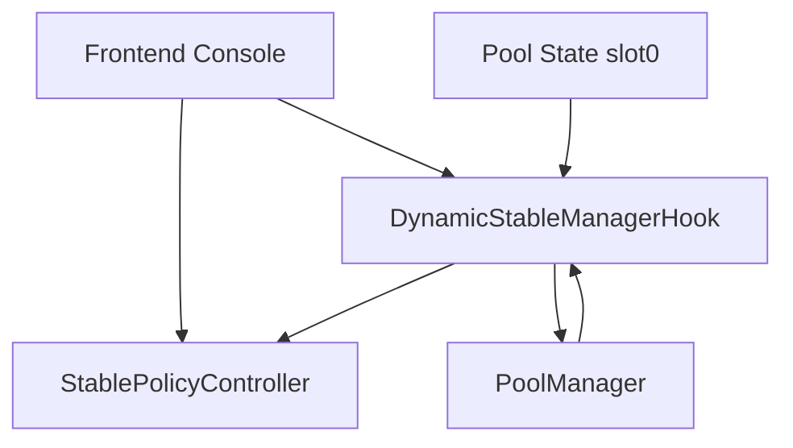
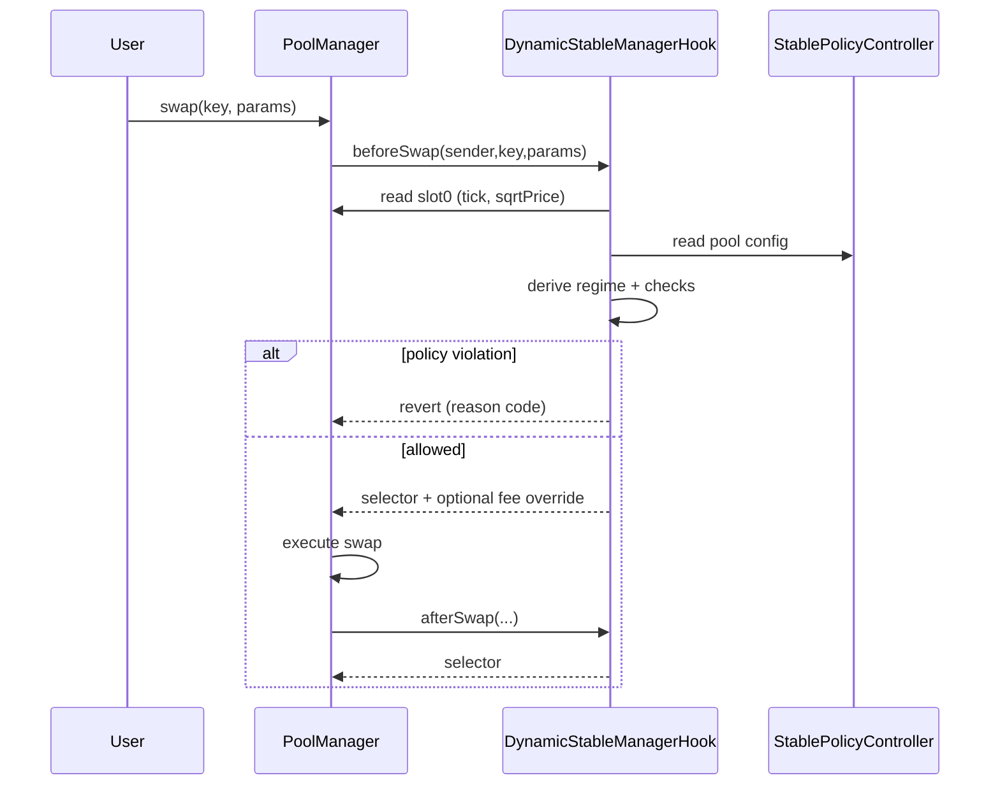
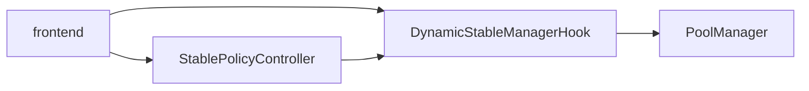

# Dynamic Stablecoin Manager Hook

<p>
  
  
</p>

Adaptive-fee, deterministic peg-defense hook for Uniswap v4 stable pools.

## Problem
Stablecoin pools face toxic order flow during depegs. Static fee pools are brittle: they either overcharge in normal conditions or under-protect LPs in stress.

## Solution
`DynamicStableManagerHook` computes swap regime *on-chain per swap* from deterministic signals:

- tick distance from peg (`|tick - pegTick|`)
- rolling tick movement proxy (abs tick delta)
- rolling imbalance proxy (net flow accumulator)

Then it applies deterministic execution policy:

- effective fee by regime (`NORMAL`, `SOFT_DEPEG`, `HARD_DEPEG`)
- max swap guardrails (soft/hard)
- max impact guardrails (soft/hard)
- optional hard-regime cooldown

No keepers, no offchain oracles for core regime decision, no reactive components.

## Monorepo Layout

```text
/
  .github/workflows/
  .vscode/
  assets/
  context/
  docs/
  frontend/
  lib/
  script/
  scripts/
  shared/
  src/
  test/
  foundry.toml
  remappings.txt
  foundry.lock
  .gitmodules
  Makefile
  pnpm-lock.yaml
```

## Architecture



### Swap Lifecycle



### Component Interaction



## Contracts

- `src/DynamicStableManagerHook.sol`
  - implements Uniswap v4 core hook functions (`beforeSwap`, `afterSwap`)
  - enforces `onlyPoolManager` through `BaseHook`
  - reads `PoolConfig` from controller
  - applies regime fee/guardrails deterministically
  - emits `PolicyTriggered(poolId, regime, reasonCode)`

- `src/StablePolicyController.sol`
  - stores policy config per pool ID
  - owner/pool-admin gated updates
  - optional timelock queue/execute path
  - update frequency caps
  - nonce-based replay-safe updates
  - emits `ConfigSet(indexed poolId, configHash, policyNonce)`

- `src/libraries/PolicyMath.sol`
  - regime selection with hysteresis
  - impact estimate helper
  - deterministic reason codes

## Regimes

1. `NORMAL`
- deviation inside band1
- lowest fee
- no restrictive caps by default

2. `SOFT_DEPEG`
- outside band1 and within band2 (with hysteresis handling)
- higher fee
- soft max swap / max impact

3. `HARD_DEPEG`
- outside band2 OR volatility/imbalance threshold breach
- highest fee
- strict max swap / max impact
- optional cooldown rate-limiting

## Deterministic Dependency Strategy

- Foundry + git submodules in `/lib`
- Uniswap pinned reproducibly:
  - `lib/v4-periphery` at commit `3779387e5d296f39df543d23524b050f89a62917`
  - `lib/v4-core` pinned to the exact core commit referenced by that periphery commit
- lockfiles:
  - `foundry.lock`
  - `pnpm-lock.yaml`
- CI verifies pinned dependency integrity (`scripts/verify_dependencies.sh`)

## Quickstart

```bash
make bootstrap
make build
make test
make coverage
```

`make coverage` enforces 100% line+branch coverage on tracked production contracts (`src/**` excluding mocks).

## Demo

### Full End-to-End Workflow

```bash
make demo-workflow
```

Detailed phase-by-phase script flow:
- [End-to-End Workflow](./docs/e2e-workflow.md)

### Local

```bash
make demo-local
```

### Stress Test

```bash
make demo-stress
```

### Unichain Sepolia Deploy + tx links

```bash
UNICHAIN_SEPOLIA_RPC_URL=... PRIVATE_KEY=... POOL_MANAGER=... make demo-testnet
```

## Security Model

- hook entrypoints callable only by PoolManager (`BaseHook.onlyPoolManager`)
- permissions encoded in hook address bits and validated in production hook constructor
- controller updates gated by owner / pool admin
- optional timelock and frequency caps
- bounded config validation prevents unsafe fee/band ordering

See `SECURITY.md` and `docs/security.md`.

## Documentation Index

- [Overview](./docs/overview.md)
- [Architecture](./docs/architecture.md)
- [Policy Model](./docs/policy-model.md)
- [Peg Defense](./docs/peg-defense.md)
- [Security](./docs/security.md)
- [Deployment](./docs/deployment.md)
- [Demo Guide](./docs/demo.md)
- [End-to-End Workflow](./docs/e2e-workflow.md)
- [API](./docs/api.md)
- [Testing](./docs/testing.md)
- [Frontend](./docs/frontend.md)

## Context Sources Used

Primary context used from this repository:
- `context/uniswap_docs/docs/docs/contracts/v4/concepts/hooks.mdx`
- `context/uniswap_docs/docs/docs/contracts/v4/guides/hooks/hook-deployment.mdx`
- `context/uniswap_docs/docs/docs/contracts/v4/quickstart/hooks/swap.mdx`
- `context/HOOKS_QUICK_REFERENCE.md`

Pinned Uniswap references used for implementation alignment:
- `lib/v4-core`
- `lib/v4-periphery`
