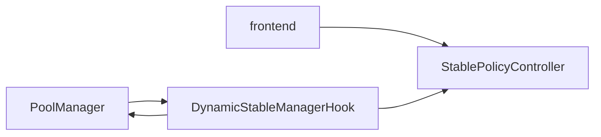

# Architecture

## Contracts

- `StablePolicyController`
  - per-pool config storage
  - owner/admin update controls
  - optional timelock queue/execute path

- `DynamicStableManagerHook`
  - before/after swap hooks
  - reads slot0 + controller config
  - enforces regime-dependent guardrails

- `PolicyMath`
  - pure math for regime and impact calculations

## Permission Bit Invariant

Uniswap v4 hook permissions are encoded in the hook address bits.

Production hook deployment validates those permissions in constructor via `Hooks.validateHookPermissions`.

## Diagram

