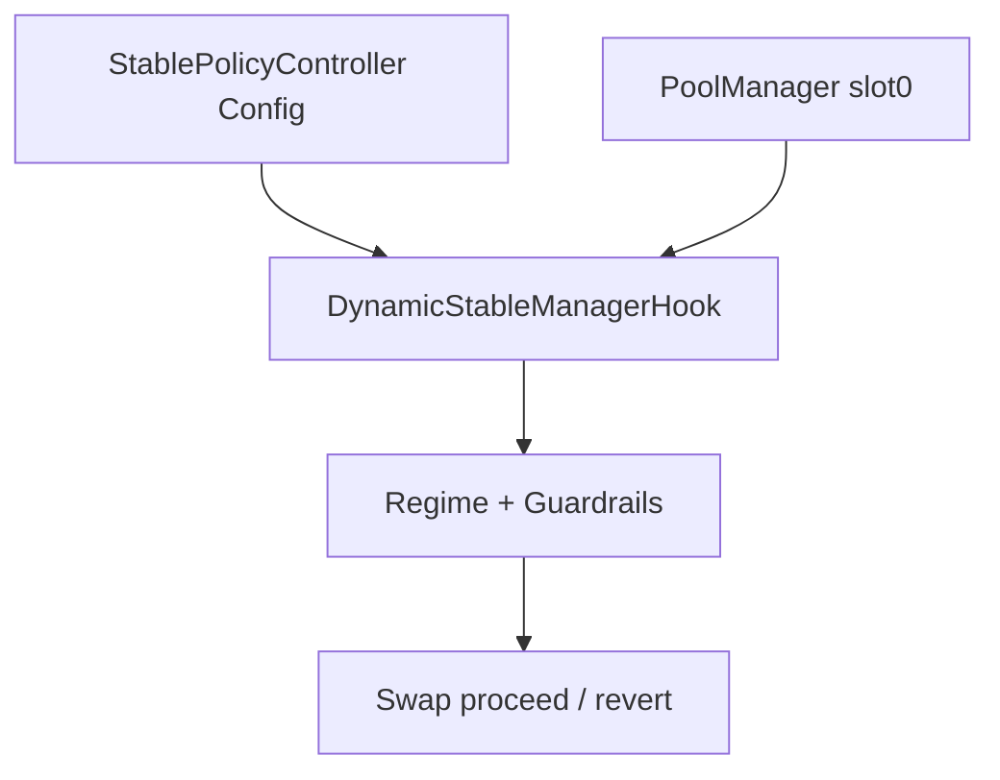
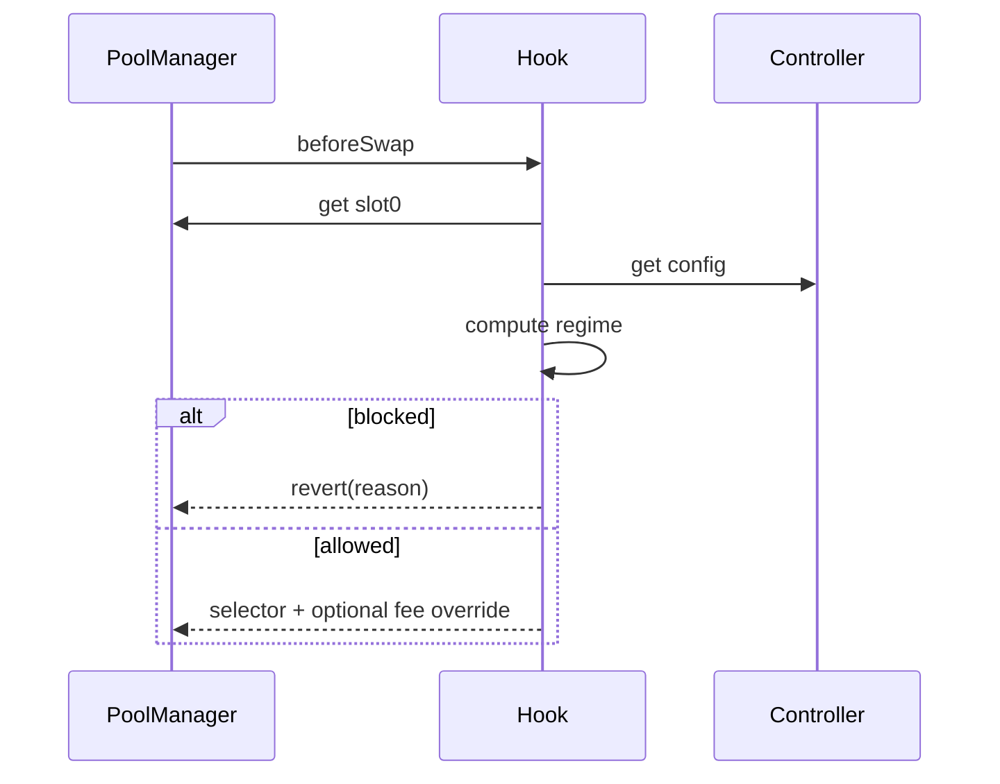

# Spec: Dynamic Stablecoin Manager Hook

## Objective
Create a Uniswap v4 stable-pool hook that deterministically changes execution policy per swap based on on-chain market state.

## Scope

- In-scope:
  - regime selection (`NORMAL`, `SOFT_DEPEG`, `HARD_DEPEG`)
  - fee schedule selection by regime
  - deterministic guardrails (`maxSwap`, `maxImpact`, `cooldown`)
  - owner/admin governance for policy updates
  - test suite (unit + edge + fuzz + integration-style)
  - local and testnet deployment/demo workflows

- Out-of-scope:
  - offchain oracle dependency for core regime logic
  - keeper/bot automation
  - non-deterministic reactive components

## Uniswap v4 Invariants Used

1. Hook permissions are encoded in hook address low bits.
2. PoolManager calls only the core hook functions that match those bits.
3. Hook entrypoints must only be callable by PoolManager.
4. `beforeSwap` can return dynamic LP fee override only for dynamic-fee pools and only with override flag semantics.

## Components

### `StablePolicyController`
Per-pool policy store keyed by `PoolId`.

`PoolConfig` fields:
- `enabled`
- `pegTick`
- `band1Ticks`
- `band2Ticks`
- `feeNormalBps`
- `feeSoftBps`
- `feeHardBps`
- `maxSwapSoft`
- `maxSwapHard`
- `maxImpactBpsSoft`
- `maxImpactBpsHard`
- `cooldownSecondsHard`
- `hysteresisTicks`
- `flowWindowSeconds`
- `volatilityHardThreshold`
- `imbalanceHardThreshold`
- `admin`
- `minUpdateInterval`
- `policyNonce`
- `lastUpdatedAt`

Governance:
- owner-gated controls
- pool-admin delegation
- optional timelock queue/execute path
- update frequency cap
- nonce sequencing for replay-safe updates

### `DynamicStableManagerHook`
Swap hook logic:
- reads current `slot0` from PoolManager via `StateLibrary`
- reads pool config from controller
- computes volatility proxy (`|tick - lastTick|`)
- computes imbalance proxy (`|netFlowAccumulator|` inside rolling window)
- selects regime through `PolicyMath`
- enforces constraints or reverts with explicit errors
- returns fee override for dynamic-fee pools

### `PolicyMath`
Pure deterministic logic:
- absolute tick distance
- hysteresis-aware regime selection
- impact estimate helper (`sqrtPrice` vs limit)

## Regime Logic

Base signal: `deviation = abs(currentTick - pegTick)`.

- `NORMAL`: `deviation <= band1`
- `SOFT_DEPEG`: `band1 < deviation <= band2`
- `HARD_DEPEG`: `deviation > band2`

Escalation to `HARD_DEPEG` if either proxy threshold is crossed:
- `volatilityProxy >= volatilityHardThreshold`
- `imbalanceProxy >= imbalanceHardThreshold`

Hysteresis:
- from `SOFT_DEPEG`, remain soft until `deviation <= band1 - hysteresis`
- from `HARD_DEPEG`, remain hard until `deviation <= band2 - hysteresis`

## Reason Codes

- `NORMAL`
- `SOFT_DEPEG`
- `HARD_DEPEG`
- `COOLDOWN`
- `MAX_SWAP_EXCEEDED`
- `IMPACT_TOO_HIGH`
- `CONFIG_DISABLED`

## Event Model

- `ConfigSet(indexed poolId, configHash, policyNonce)`
- `PolicyTriggered(indexed poolId, regime, reasonCode)`

No telemetry-heavy event streams are required for core correctness.

## Fee Semantics

Controller stores fee in basis points (`0..10_000`).

Hook conversion:
- `bps -> hundredths of bip` by multiplying by `100`
- for dynamic-fee pool, hook returns `fee | OVERRIDE_FEE_FLAG`

If pool is not dynamic-fee, hook returns zero fee override and still enforces guardrails.

## Security Notes

- no claim of attack-proofness
- misconfiguration can cause liveness loss
- griefing via repeated boundary swaps is mitigated by hysteresis + optional cooldown
- admin risk reduced with timelock and min update intervals
- onlyPoolManager invariant preserved by BaseHook

## Dependency Reproducibility

- `lib/v4-periphery` pinned to `3779387e5d296f39df543d23524b050f89a62917`
- `lib/v4-core` pinned to submodule target referenced by that periphery commit
- reproducibility script: `scripts/bootstrap.sh`
- CI guard: `scripts/verify_dependencies.sh`

## Diagrams

## Context Reconciliation

Primary reference set used:
- `context/uniswap_docs/docs/docs/contracts/v4/concepts/hooks.mdx`
- `context/uniswap_docs/docs/docs/contracts/v4/guides/hooks/hook-deployment.mdx`
- `context/uniswap_docs/docs/docs/contracts/v4/quickstart/hooks/swap.mdx`

These were reconciled against pinned implementation references:
- `lib/v4-core`
- `lib/v4-periphery`
